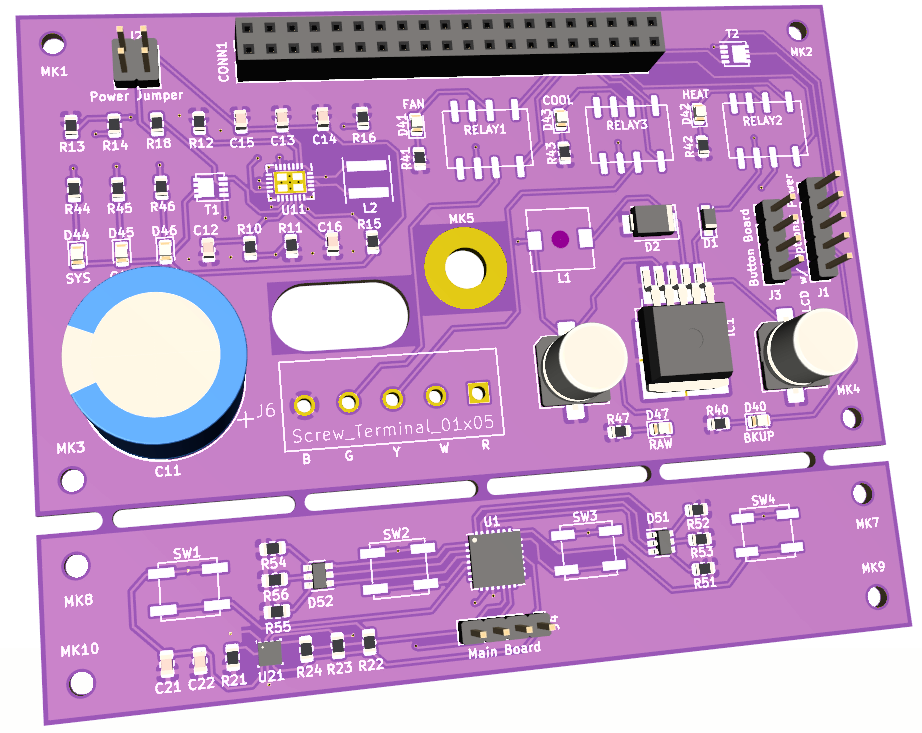

# rpt

RaspberryPi-powered Griddy-enabled thermostat

## Overview

RPT is yet another Python-based, Raspberry Pi powered thermostat, with the added twist that [GoGriddy](https://www.gogriddy.com/) customers can vary temperature targets based on the current cost of electricity.

## 

## Features

* Simple user interface at the thermostat for setting temperature targets
* Simple web interface (hosted by the thermostat) for configuring from remote
* RESTful API for getting current environmental data as well as changing settings

## More Topics

* [Gettings started](docs/setup.md) with rpt
* [Hardware](docs/hardware.md) overview
* [Movations](docs/motivation.md) for yet another thermostat
