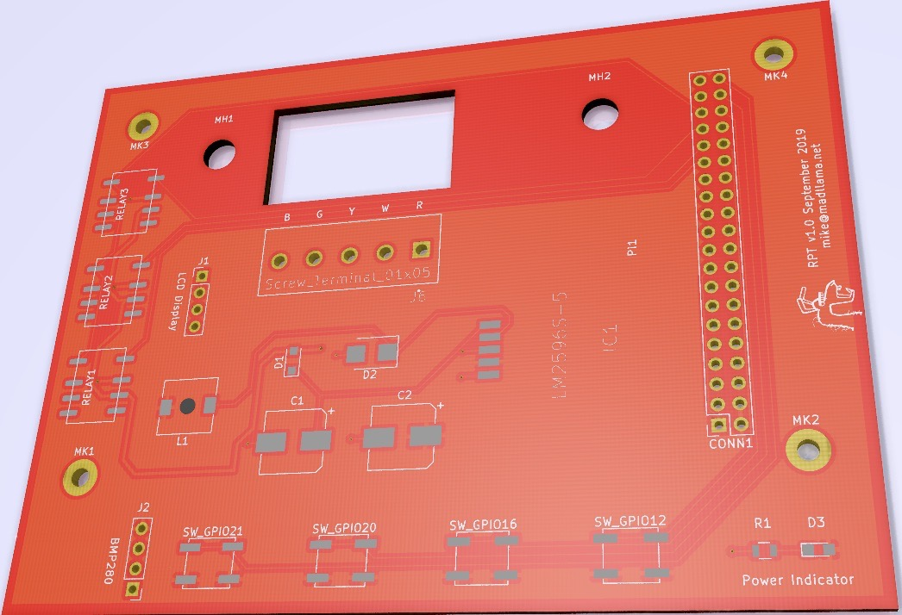

# Design

I kicked the idea of building a simple thermostat around for a few years.  My first iteration was a C++/Qt thermostat with a nice LCD touchscreen.  But since the RaspberryPi isn't the best _development_ environment, that quickly turned into a rabbit hole of C++ cross-compiling and libc compatibility, and don't get me started on the LCD display.

Picking the project up again in September, I took a more 'agile' approach and embraced an MVP that had a working hardware/software combination to get something *working*!  From there, we can refine.  So with that in mind, I started over in python.

The board is very simple, integrating:
* 24V AC to 5V DC power conversion
* RaspberryPi Zero W
* Three independent relays (cooling, heating, and fan)
* 20x4 character-based LCD
* 5-way temminal block to host the 5-wire thermostat cable
* 4 buttons for user input
* 2 I2C headers for the temperature sensor (BMP280) and the LCD

This is board v1.0, and there are many things that absolutely need to be changed.  I intend on writing an entire article on what I learned by running this board for a period of time and what will go into v2.0.

I'd like to thank Ray at Rays Hobby for a [great write-up on 24V AC to 5V DC power conversion](https://rayshobby.net/wordpress/24vac-to-5vdc-conversion/).  I personally run Ray's [OpenSprinkler Pi (OSPi) platform](https://opensprinkler.com/product/opensprinkler-pi/) (with the 8-zone extender!) and was inspired to take a shot at my own board by reading his blog posts.