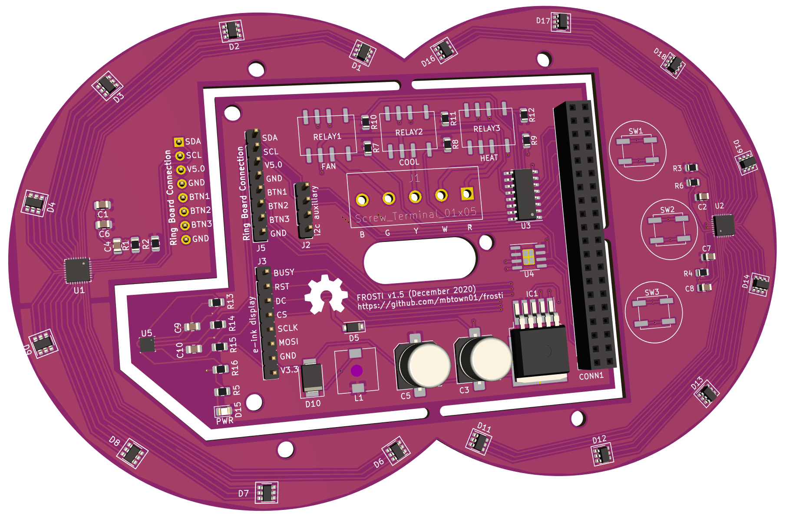

At the heart of this project is the circuity that attaches to the
Raspberry Pi and hosts the extra elements that make the thermostat work.

The board integrates the following components:

* 24V AC to 5V DC transformer circuit
* Relays for A/C, heat and fan (simple 5-wire)
* Header for the e-paper display (Waveshare 2.9" with partial update)
* Two partial rings of 8 multi-color LEDs, each controlled w/ an LP5024
  LED driver chip for high-frequency dimming and color mixing
* BME280 environment sensor, capturing temperature, pressure and humidity
* A CAT24C256 for i2c-based storage (a component I have some ideas for
  but honestly have no clue for sure what I'll do with!)

## Thermostat connection

FROSTI runs on the standard "5-wire" thermostat configuration, with the
following connections:

* Blue -- Common ground
* Green -- Return to power **fan**
* Yellow -- Return to power **A/C**
* White -- Return to power **heat**
* Red -- Thermostat 24V power input

The main board has a 5-port screw terminal, with the 1st letter of the wire
color labeled for installation.  

## Ring Board

The

## Credits

I'd like to thank  Rays Hobby for a [great write-up on 24V AC to 5V DC power
conversion](https://rayshobby.net/wordpress/24vac-to-5vdc-conversion/).  I
personally run Ray's [OpenSprinkler Pi (OSPi)
platform](https://opensprinkler.com/product/opensprinkler-pi/) (with the 8-zone
extender!) and was inspired to take a shot at my own board by reading his blog
posts.
