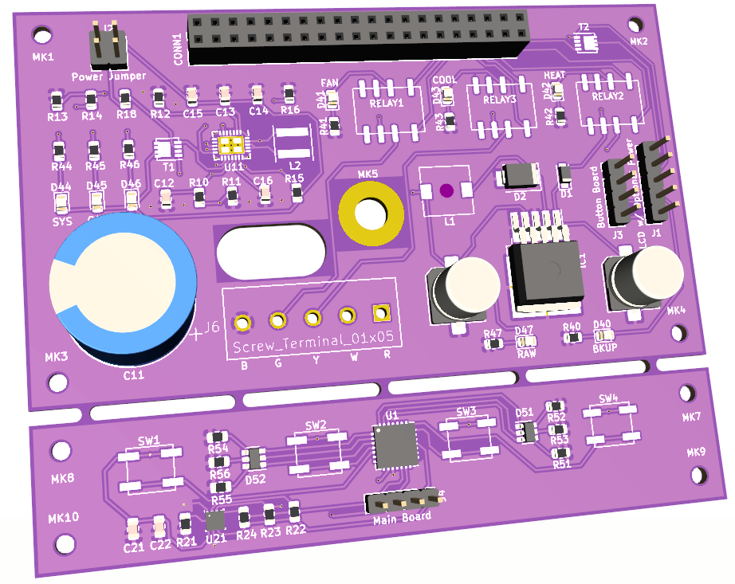

# Hardware

I've taken an 'agile' approach to this project and focused on an MVP that
delivers a simple hardware/software combination.  *Once that works*, then
I'll focus on refinements.



The board integrates the following components:

* 24V AC to 5V DC power conversion to power everything from the HVAC
* RaspberryPi Zero W
* Three independent relays (cooling, heating, and fan)
* I2C header for 20x4 character-based LCD
* 5-way temminal block to host the 5-wire thermostat cable
* 4 buttons for user input on a break-away daughter board
* Integrated BME280 temperature sensor
* Integrated supercapacitor to handle power sags
* 2 multi-color LEDs for indicating any kind of state
* Several status LEDs for board features

## Power Header (J2)

The power jumper is the 2x2 header at the top-left.  It's designed to be used with two shunts.  Connecting the two *rows* will engage the supercapacitor circuitry.  Should that circuit not work as planned, a shunt across the first *column* will disconnect the supercapacitor circuit and power everything directly from the raw 24V -> 5V conversion.  And yes, somehow I silkscreen'd 'Power Jumper', should have been 'Power Header'.

## LCD w/ Optional MOSFET-driven Power Header (J1)

Only 4 pins are needed for a header to drive the LCD.  This header includes an optional 5th pin which represents power controlled be a MOSFET (T2).  I'm not sure if it's going to work as designed, so I've left the raw power pin here.  Pins from top-down are GND, *MOSFET-driven power*, 5V, SDA, SCL.

## Button Board and Header

The break-away board at the bottom contains the buttons, temperature sensor, and some multi-colored LED indicators.  This breaks away so it can be placed at the face of the thermostat, moving the sensor away from the heat of the main board components, exposing the LEDs, and getting the buttons closer to the user.  To make this board happen with as few pins on the header as possible, a GPIO extension chip (U1) is included.  Via i2c, we can now simply use the GPIO pins on U1 to read buttons and drive the LCDs.  The alternative was 10+ pins and the corresponding cabling... 

## Screw Terminal

The connecting screw terminal is near a hole in the board to allow the thermostat cable through.  Each pin is labeled below with the first letters for blue, green, yellow, white, red.  These are:

* Blue -- Common ground
* Green -- Return to power **fan**
* Yellow -- Return to power **A/C**
* White -- Return to power **heat**
* Red -- Thermostat 24V power input

## Simulator for Relays

The code below can be pasted into the circuit simpulator at
https://www.falstad.com/circuit/.  Mouser part 667-ERJ-P06F64R9V
can dissipate up to 500mW, which this circuit will get to about
80% to move the relay.

```
$ 1 0.000005 10.20027730826997 50 5 43
r 368 272 368 160 0 64
r 224 272 224 160 0 64
r 368 272 224 272 0 90
w 224 160 368 160 0
v 128 352 128 160 0 0 40 5 0 0 0.5
w 128 160 224 160 0
s 224 272 224 352 0 1 false
s 368 272 368 352 0 1 false
w 128 352 224 352 0
w 224 352 368 352 0
```

## Credits

I'd like to thank  Rays Hobby for a
[great write-up on 24V AC to 5V DC power conversion](https://rayshobby.net/wordpress/24vac-to-5vdc-conversion/).  I personally run Ray's
[OpenSprinkler Pi (OSPi) platform](https://opensprinkler.com/product/opensprinkler-pi/) (with the 8-zone extender!) and was inspired to take a shot at my own board by reading his blog posts.
